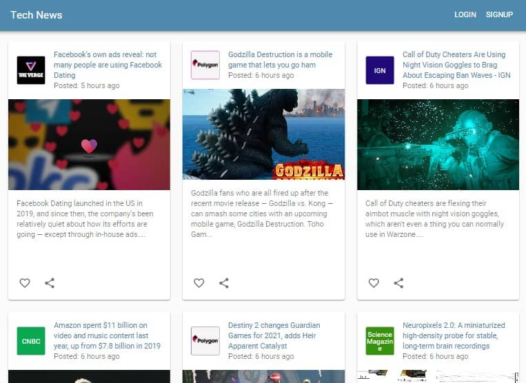

<h1 align="center">Welcome to Tech News Web App 📰</h1>
<p>
  
  
  
</p>

> This web application uses the [News API](https://newsapi.org/) to retrieve and show the latest breaking news in technology from news sources and blogs across the web.

### ✨ [Demo](https://mytechnews.netlify.app/)

## Prerequisites

- npm >=5.5.0
- node >=9.3.0

## Install

```sh
npm install
```

## Usage

```sh
npm start
```

## Built With

* [Axios](https://www.npmjs.com/package/axios) - Promise based HTTP client for the browser and node.js.
* [Firebase](https://firebase.google.com/) - Backend-as-a-Service for creating mobile and web applications.
* [React](https://reactjs.org/) - A JavaScript library for building user interfaces.
* [Redux](https://redux.js.org/) - Open-source JavaScript library for managing application state.
* [Material-UI](https://material-ui.com/) - React components for faster and easier web development.

## Screenshot
<p align="center">
  
<p>

## Author

👤 **Elmer C. Galo**

* Github: [@galoelmer](https://github.com/galoelmer)

## 🤝 Contributing

Contributions, issues and feature requests are welcome!

## Show your support

Give a ⭐️ if this project helped you!
